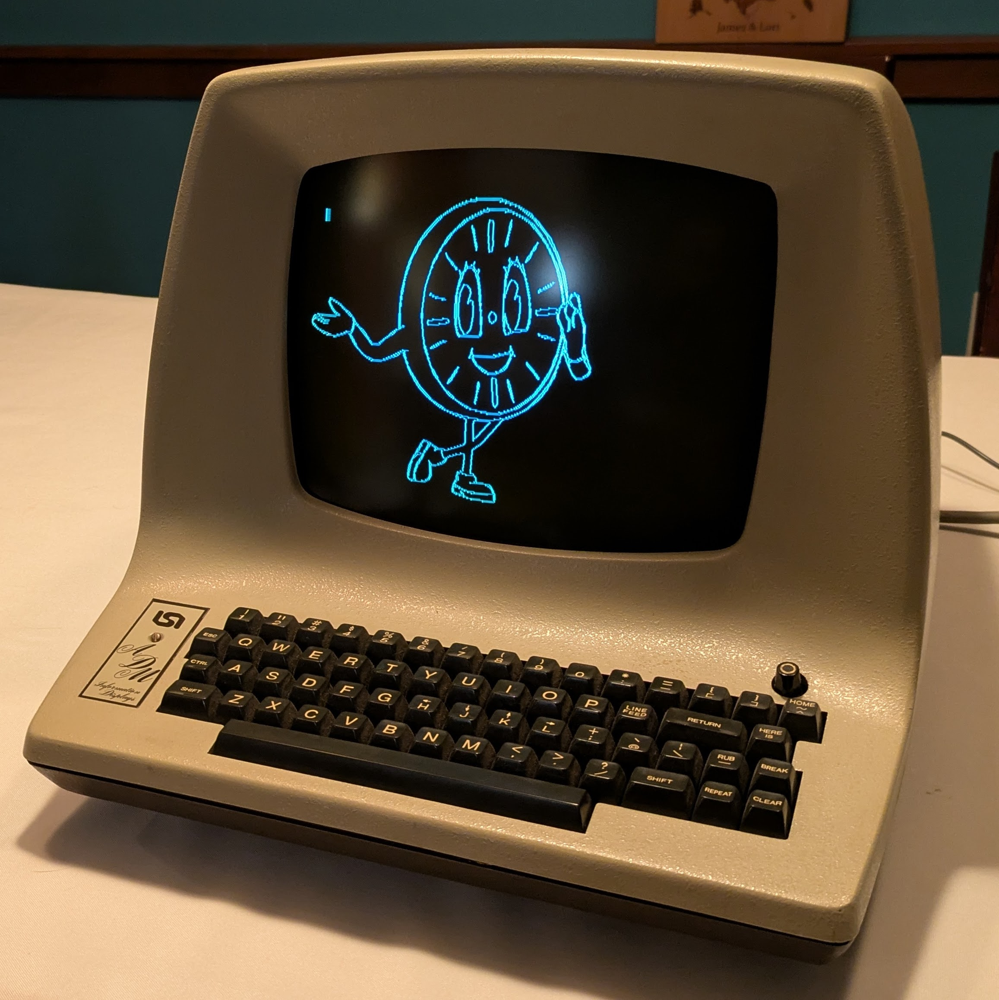

# SVG to Tektronix 4010

## Convert SVG to Tektronix 4010 characters
```
./svgtotek.py input.svg -o output.tek
```

## Draw on an ADM-3A with an RG-512



Prepare a Linux host for attachment (your settings may vary)
```
stty -F /dev/ttyUSB0 9600 cs8 -cstopb -parenb -ixon
sudo agetty -L ttyUSB0 9600 adm3a
```

And run from the ADM-3A
```
./svgtotek.py input.svg -d -t 30
```

---

## Simplify SVG files if necessary before rendering to Tektronix format

`inkscape input.svg --batch-process --actions='EditSelectAll;SelectionSimplify;FileSave;FileClose'`

## About Resolution

From RETRO-GRAPHIX Users Manual:

"The RG-512 graphics grid is automatically scaled to the graphics grid used by Tektronix Plot 10 software"

  - Tektronix Plot 10: 1024 x 780
  - RG-512: 512 x 250

From example, 0 based. 0-1023; 0-779

## About Encoding

- https://vt100.net/docs/vt3xx-gp/chapter13.html
- https://bitsavers.org/pdf/tektronix/401x/070-1225-00_4010um_Jul81.pdf
  - page 3-2
